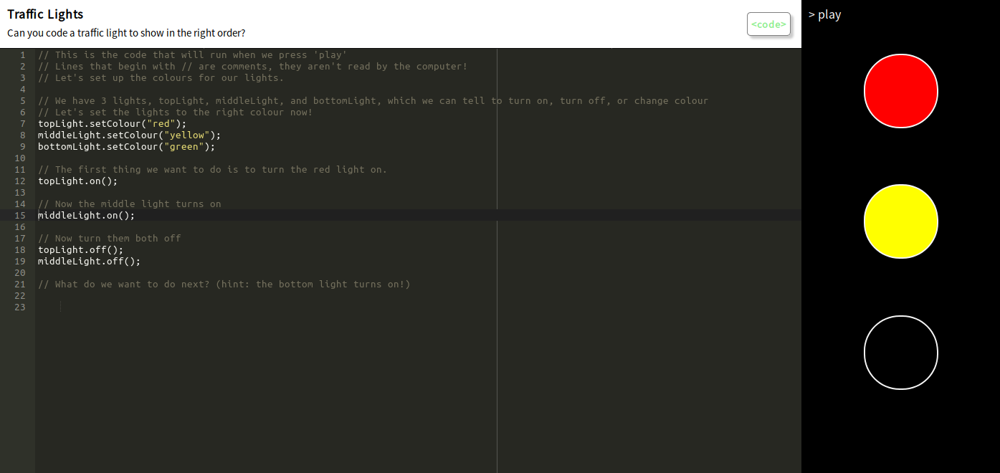
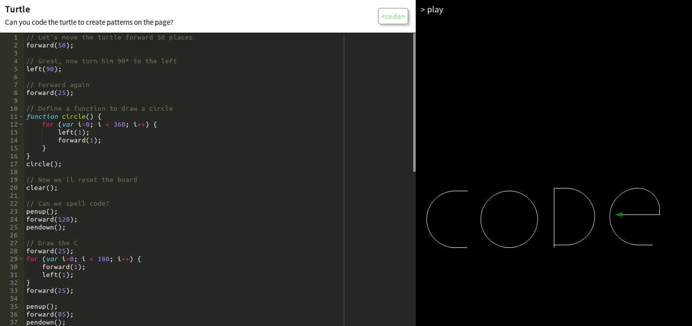

# CodeClub Programme - Winter 2019

The purpose of these interactive examples is to give 7-10 year olds an easy introduction to programming
concepts using Javascript. There are a number of great resources out there already, but I found that most 
of these were either entirely graphical (Scratch), or paid.

It turns out that by 7, schools teaching IT in their curriculum have most likely introduced the kids to
Scratch, and some parents may have already done some coding with them outside of the classroom- so these exercises try to start off slow
enough to be widely inclusive, whilst still offering routes to explore, create, and h4ck.

Importantly, we reuse components between weeks, providing an approachable framework for future projects in this style.

## Week 1 - Traffic Lights

In the first class, we want to introduce the interface that the kids will be working with, getting them to engage
with the idea of editing their code on the left, and pressing 'play' to run it on the right. We achieve this through
an interactive traffic light, which we aim to get the kids to complete.

### Outcomes
* Introduce GUI, get used to editing and playing
* Code execution order, sequential instructions
* Concept of functions, strings, and properties in JS (high level)

### Exercises
* Finish the sequence (red.on, yellow.on, red.off yellow.off, green.on, green.off, yellow.on, yellow.off, red.on)
* Reverse the traffic light

### Going Further
* Each of the colours is a HTML hex code, or colour string, teach about RGBA/Hex
* setColour is one method on that object, we can also setSize(), shuffle() etc.
* How do we execute two commands at once? **(hard)**

## Week 2 - Turtle

In the second class, we want to start drilling the ideas of code execution order, and logical progression. Classicly,
we do this with Turtle. Commands are implemented as a set of inline functions, removing the functional context idea we used in
week 1 when operating our lights - we'll come back to this later.

In our pre-loaded example, show how we can use penup() and pendown(), along with movement commands to navigate the canvas
and 'write out' a word.

### Outcomes
* Introduce functions, and for loops.
* Get comfortable with directions, angles, movements in 2D space.
* Show how we might programatically draw more complex shapes.

### Going Further
* We define a function circle() in our example - can kids implement their own?
* Turtle isn't only white, we can set colour with colour(r 0-255, g 0-255, b 0-255, a 0-1)